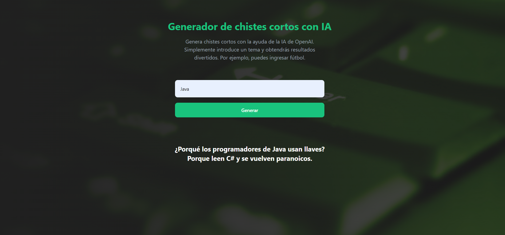

#Generador de chister ai

Generador de chistes cortos realizado con NextJS, TypeScript, Tailwind CSS y la API de OpenAI para fines educativos.

:point_right: [Live preview](https://generador-de-chistes-ia.vercel.app/)

Imagen 1:

